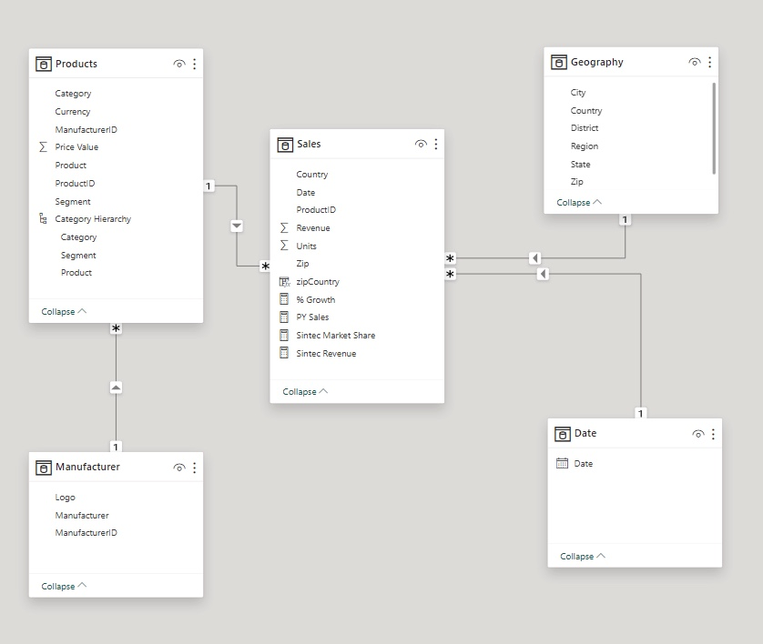
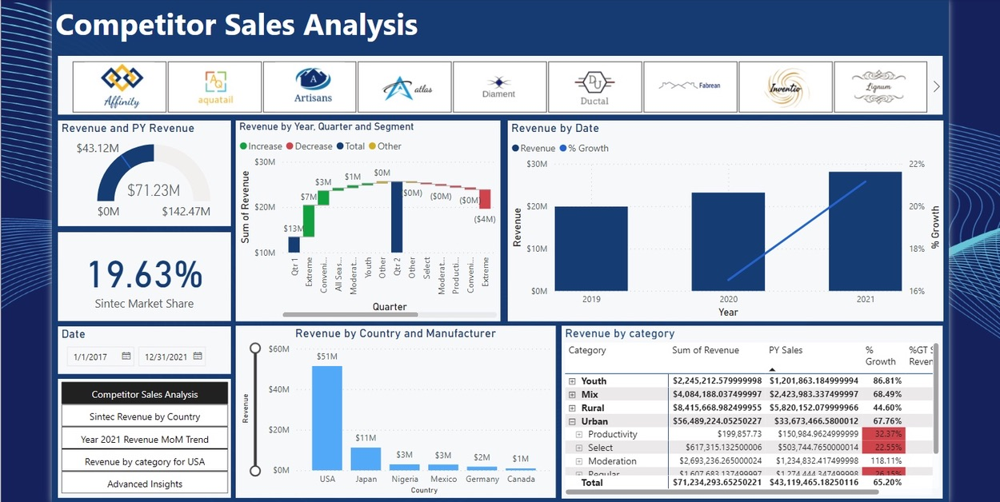
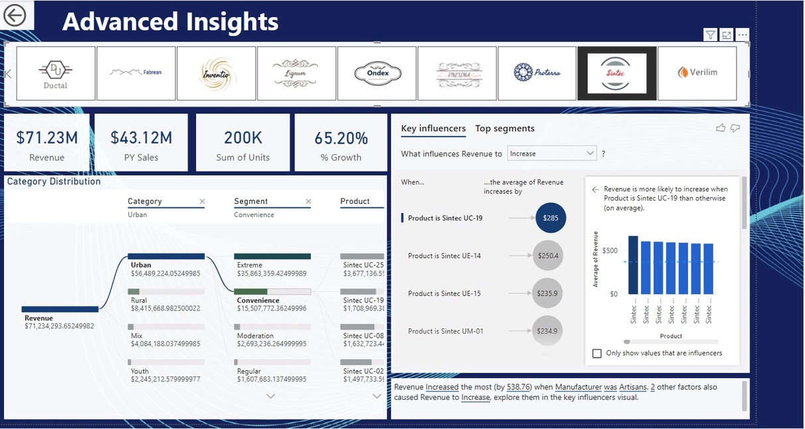
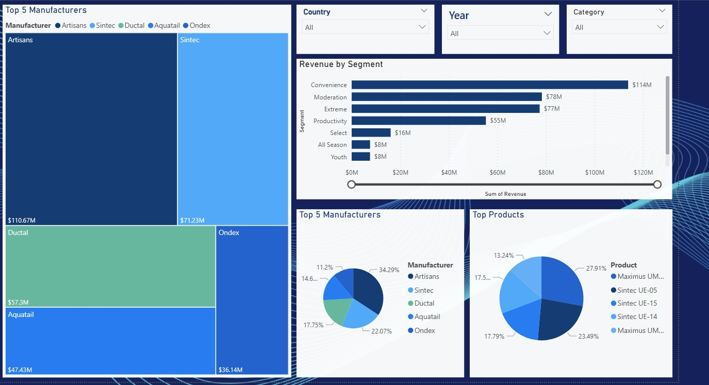
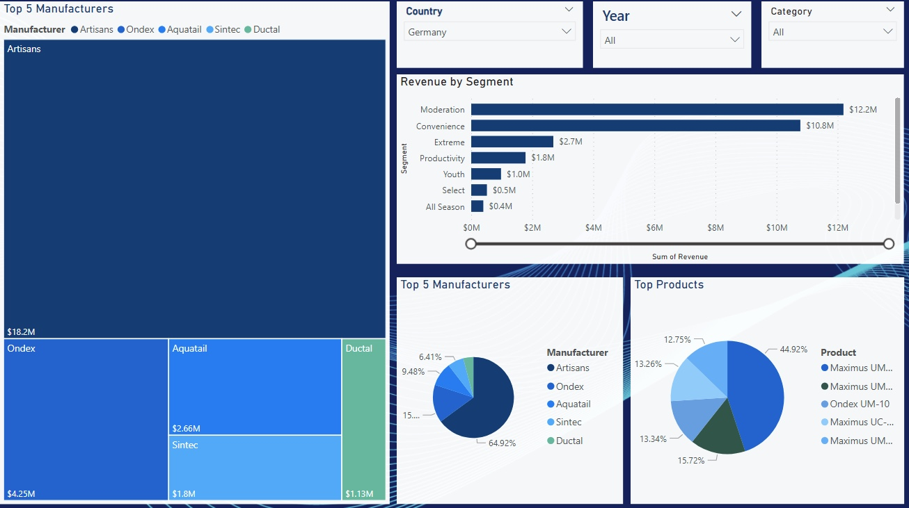

# Sintec Sales and Market Share Analysis

## Objective:

Develop a solution that evaluates the company's internal performance by analyzing product sales and compares it with the sales of top competitors, assessing how these competitors perform against each other from 2019 to 2021.

## Power BI Concepts applied:

- Data integration
- Transformation
- Modeling
- Exploratory data analysis
- DAX calculation
- Visualization
- Performance testing

## Data Sourcing

The datasets were sourced from the Datacamp.

## DATA MODELLING

- A SNOWFLAKE SCHEMA

## Data Visualization

## Conclusions

- Revenue Growth: Sintec experienced a significant revenue increase, with a growth rate of 21.16% in 2021.
- Market Share: In the USA, Sintec holds a market presence of 31.51%.
- Competition Analysis: Artisans emerges as the primary competitor, commanding over 60% of the market revenue compared to the next four competitors in Germany.
- Top Performing Segment: The Extreme Segment leads in performance for Sintec, generating revenues of $36M.
- Product Profitability: The UE-05 product stands out as one of Sintec's most profitable offerings.
